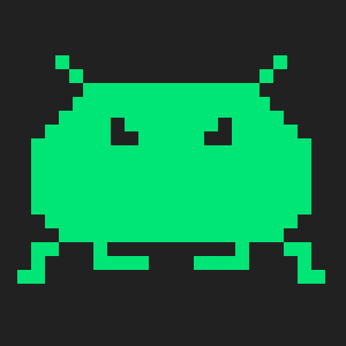

# Project Name: Space Adventure 3398
=======
> Space Adventure 3398 is an arcade style game is developed by Tanner Coker, Lucas Anesti, Brice Asburn, Erik Cortez, and Eric Figueroa.
> It will feature a main menu with options to: start the game, view the scoreboard, go to settings, and to exit the game. 
> The game will have a space theme and it will be like a retro arcade game. The gameplay will consist of the player having basic 
> movements and having to shoot projectiles at the enemies in order to wipe them out. The player will be able to progress through 
> stages and will encounter boss fights and more difficult enemies along their travels. The game will save the top scores of 
> all players across multiple play sessions which is viewable in the scoreboard. Players can also find some settings and will be 
> able to tweak some gameplay settings through a settings area which is on the main menu.
> We're making this game so that we can further develop our skills as programmers but make it entertaining for anybody to enjoy.
> The game would be for an audience of many or people who just want to play a fun arcade style game. 

## Table of contents
* [General info](#general-info)
* [Screenshots](#screenshots)
* [Technologies](#technologies)
* [Setup](#setup)
* [Features](#features)
* [Status](#status)
* [Inspiration](#inspiration)
* [Contact](#contact)

## General info
The goal of the project is to make an entertaining game while practicing sound Software Engineering principles in a team.

## Screenshots

## Technologies
Java version 11.0.8, 
Git	version 2.17.1, 
Sourcetree version 4.0.2, 
Jira, 
BitBucket.

Here is a list of hypelinks that describe our technolgies that will be used for this project:

https://www.oracle.com/java/technologies/javase-downloads.html#JDK11,

## Setup
Describe how to install / setup your local environement / add link to demo version.

## Code Examples
Show examples of usage:
`put-your-code-here`

## Features
List of features ready and TODOs for future development

Features list:

Customizable player ship

Cheat codes

Variety of boss fights

To-do list:

Design a UML for overall game

Create the game mechanics

Create a background (non-thematic)

Create players/enemies of game

Create game menu

## Status
Project is: In progess...

## Inspiration
Project inspired by..., based on...

## Contact
Created by Tanner Coker, Lucas Anesti, Brice Asburn, Erik Cortez and Eric Figueroa.
