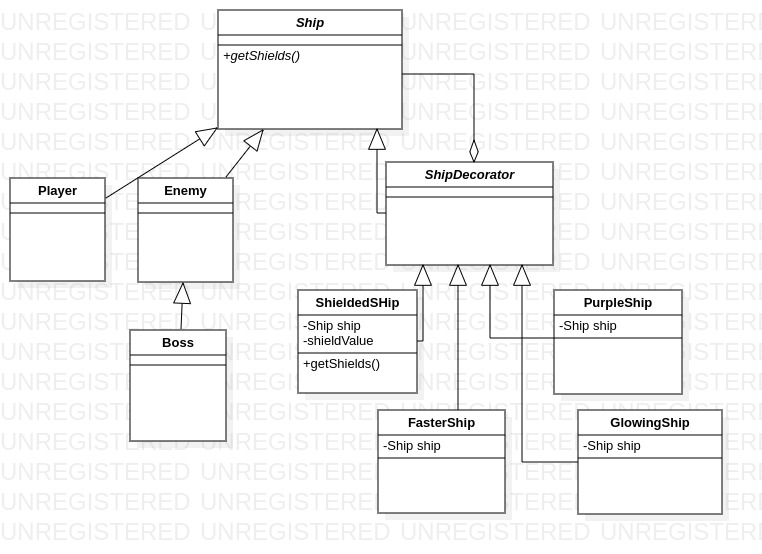
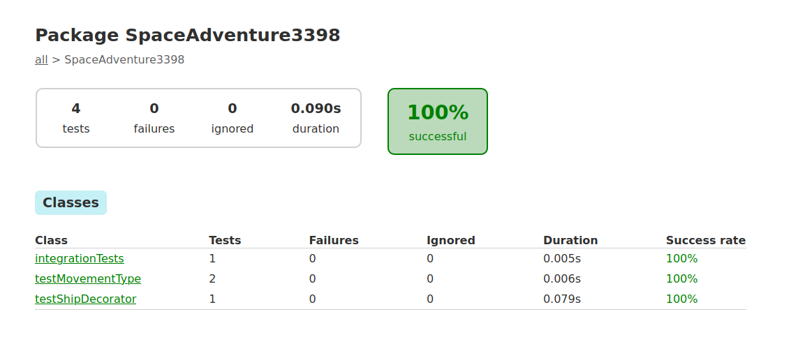
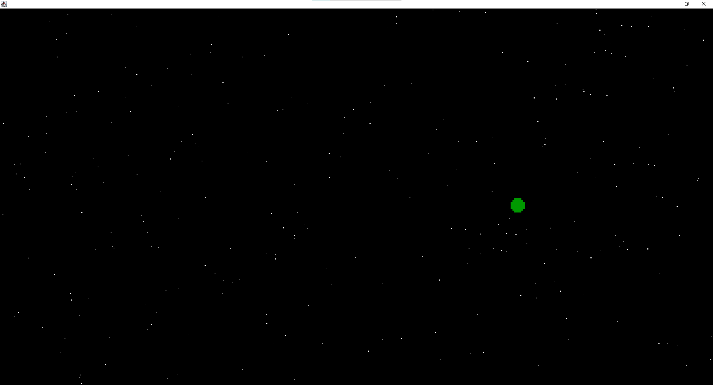

# Space Adventure 3398
> Space Adventure 3398 is an arcade style game is developed by Tanner Coker, Lucas Anesti, Brice Ashburn, Erik Cortez, and Eric Figueroa.
> It will feature a main menu with options to: start the game, view the scoreboard, go to settings, and to exit the game. 
> The game will have a space theme and it will be similar to a retro arcade game. The gameplay will consist of the player having basic 
> movements and having to shoot projectiles at the enemies in order to wipe them out. The player will be able to progress through 
> stages and will encounter boss fights and more difficult enemies along their travels. The game will save the top scores of 
> all players across multiple play sessions which is viewable in the scoreboard. Players can also find some settings and will be 
> able to tweak some gameplay settings through a settings area which is on the main menu.
> We're creating this game to further develop our skills as programmers but also it entertaining for anybody to enjoy.
> The audience for Space Advenuter 3398 can be for everyone or people who just want to play a fun arcade style game. 

## Table of contents
* [General info](#general-info)
* [Screenshots](#screenshots)
* [Technologies](#technologies)
* [Setup](#setup)
* [Features](#features)
* [Status](#status)
* [Inspiration](#inspiration)
* [Contact](#contact)

## General info
The goal of the project is to make an entertaining game while practicing sound Software Engineering principles in a team.

Here is a picture of our game logo:

## Technologies
* Java version 11.0.8 (https://www.oracle.com/java/) 
* Git	version 2.17.1 (https://github.com/team) 
* Sourcetree version 4.0.2 (https://support.atlassian.com/bitbucket-cloud/docs/tutorial-learn-bitbucket-with-sourcetree/)
* Jira (https://www.atlassian.com/software/jira)
* BitBucket (https://bitbucket.org/product)

## Setup
* Follow the hyperlinks listed above to set up your local enviorment needed.

## Code Examples

* Code is in progess...

## Features

Features list:

* Ship Builder- player will be able to choose and customize their ship for gameplay. Corresponds to Controllabe Character user story

* Cheat Codes- player will be able to tweak gameplay features by inputing a special code with game controls. Corresponds to Cheat/Bonus user story

* Boss Level Difficulty- player will be able to choose difficulty of game before starting. Corresponds to Scalable Difficulty user story

To-do list:

* Design a UML for overall game

* Create the game mechanics

* Create a background (non-thematic)

* Create players/enemies of game

* Create game menu

## Status
Project is: 

* In progess...

## Inspiration
Project inspired by aracde style games.

## Contact
Created by Tanner Coker, Lucas Anesti, Brice Ashburn, Erik Cortez and Eric Figueroa.

# Sprint 1 Review (Assignment 11)

### Brice Ashburn
As a team we all have been working on individual classes and implementations for our end goal for the game. I have been able to finish the bullet class as part to implenmented with my groupmates, there was a few blocks as I fairly new to Java and had to watch many videos to learn about these designs. My team have also completing their work as you can see the back done by Tanner is very high quaily and 
has many aspects to it. As a team we are having to learn SourceTree, BitBucket and Jira on the fly lucky although it still takes up a lot of time it has been interesting to learn. I am still working correcting the hitbox as it has a few bugs still.

### Lucas Anesti
The Design Patterns that will be used for the game have been finalized and the code for the class design have been implemented. In addition, both unit testing for the individual design patterns and integration testing between the patterns have been completed using JUnit. The following two documents demonstrate the progress made:

Currently, the code and the documentation is stored under the DesignPatterns branch. The following links can be used to find:

* Documentation: https://bitbucket.org/cs3398f20klingons/space-adventure-3398/src/DesignPatterns/doc/UML/

* Source Code: https://bitbucket.org/cs3398f20klingons/space-adventure-3398/src/DesignPatterns/src/main/java/SpaceAdventure3398/

* Testing Code: https://bitbucket.org/cs3398f20klingons/space-adventure-3398/src/DesignPatterns/src/test/java/SpaceAdventure3398/

The code shows basic application of some of the design patterns and how to use them in reference to the game. The design patterns will become more relevant as we update the game design to include more features. For the time being, that remain a separate and abstract component of the game design process until the initial game units have been implemented and ready to be combined.

Currently, they are not used by the team and not intended to be merged into the Development branch.

To run the code, checkout the 'DesignPatterns' branch, navigate to the directory where the build.xml file is and run the following commands in the specified order: 'ant clean, ant compile, ant jar, ant run'. You should see descriptive output of design patterns and interactions among them.

To run the tests, checkout the 'DesignPatterns' branch, navigate to the main directory, and run the commands 'gradle build' and 'gradle test'. Once the buikld is succesful, the report for the test can be found ubder build/report/tests/test/index.html.

### Tanner Coker
The Background, Stars, and Planets classes have all been added and are working together. Stars and Planets both 
implement interface "SpaceBodies". The background is a Black screen that has white stars and green planets 
moving from the top of the screen to the bottom. Stars and planets change their x/y-cood., size, and speed each
time it is moved back to it's respective y-coord. Additional classes were made as well that include TestRunner
which I used to test run the code and "UpdateThread" which is just an extension of Thread and that is used to 
update the stars and planets on the background.

The java files are currently located in the Development branch since I have merged the background branch into it. It will be in moved to master once other members have finished merging their branches
to master.

* Source code: https://bitbucket.org/cs3398f20klingons/space-adventure-3398/branch/Development

### Erik Cortez
I've created a few sprites in the development branch which represent the player and enemies or a boss. The sprites will be used in the ship
class which will allow them to move. The ship class is partially complete with some methods but doesn't function yet.

### Eric Figueroa
The player and enemy classes have been added but are still having issues. My classes should create the player and enemy but keeps crashing. Should permit movement from left to right of the screen for players and flying abilities at top of screen for enemies. The players and enemy movement/tactics differ from one another also depending on level. Code does not run yet. Still new to developing in java, especially a game with graphics and images.

## Status

* Brice Ashburn: completed.

* Lucas Anesti: completed.

* Tanner Coker: completed.

* Erik Cortez: 

* Eric Figueroa: completed.

## Next Steps (Assignment 11)

* Brice Ashburn:The next step for me is to keep working out the bugs on the hitbox and starting to think about a main menu.
		As a team our next step should to continue learning SouceTree and Bitbuck/Jira as well to continue working on parts of the project/game.

* Lucas Anesti: The next steps for me would be to incorporate the design patterns into the running code. This will require combingin and removing code, updating or replacing stubs with code created by teammates, rewriting the javadoc documentation, and redesigning unit and integration testing for the patterns using concrete objects. 

* Tanner Coker: My next step will likely be to add all of the separate moving parts such as enemies and the player to the background.

* Erik Cortez: 

* Eric Figueroa: The next steps for me would be to get the errors to stop occurring and start combining into other sections of Space Adventures code. This will require further communication with team about how to incorporate each other’s code and possible rewriting and redesigning if needed with testing to ensure that it works smoothly after combining.

## Retrospective (Assignment 11)

### What went well

* Team: We were able to reach an agreement on game design decisions early on. We have produced artifacts for our project, including design documents and functional game components.

* Team: We developed our own game assets instead of using online resources. As a result, we do not have to worry about copyright issues when we make our game available.

* Brice Ashburn: I was able to find multiple examples online and tutorial videos that really taught me a lot. Our group haas done a great job of communicating almost every day about progress and bugs and meeting times.

* Lucas Anesti: I was able to find some design patterns that are applicable and useful to our game. We believe that the patterns will help us write more flexible, extensible, and thread safe code. However, limited knowledge of design patterns required me to do extensive research on the justification and the implementation of each pattern. As a result, the time spent on completing the tasks exceeds the projected numbers by a large margin. Also issued an incorrect merge on git, so had to hunt down scattered code in multiple commits to recreate certain branches.

* Tanner Coker: I was able to find some sample code that showed a background with moving pieces. I modified my stars and planets class so that I can incorporate some of the ideas that I got by viewing the other project. Originally the classes were extending JPanels and after viewing the other project I had seen that they extended their moving objects from the Rectangles class and so I did that as well with success.

* Erik Cortez: 

* Eric Figueroa: As a team, things that went well were helping and guiding one another when we would encounter problems on source tree. We are currently still adjusting to new environments.

### What might be Impeding us

* Our schedule conflict is possibly impeding us from performing better. Many of us work on the weekends, so our meetings are held late during some weekdays. In addition,we do not have much experience with game design and implementation. Finally, we are not entirely comfortable with Java, but we feel that it is the best language for the task.

### What can we do to improve

* Team: We will have to find a better way to communicate as expecting to get things done during real-time online meetings is not feasible due to schedule conflicts. While we have not measured it, we only had very few meeting where every teem member was present. This metric indicates that zoom meetings are not the best form of communication and not ideal to achieve our target productivity. We are currently considering improving our communication through slack. A possible metric for success can be counting the number of responses that a message on slack receives. If too few people,say 2 out of 5, are responding on a regular basis, then we can suspect that the communication is not working. In addition we can look at the response time for possibly improving the timing of the communication in the event that responses are posted by everyone but sporadically.

* Team: In the last sprint, we did not update our code regularly on bitbucket, so many of us were unaware on the progress made by the other team members. In this sprint, we can aim for regular updates. One way to ensure this is to ask each member to commit something every time period, say 3 days. The metric will be to count the number of missing commits, which will tell us if we need to reassign team member for load balancing. Some tasks may be harder than others, so the absence of a commit can indicate that our time estimates for completing tasks were off.

* Team: We did not observe the dependencies between our objectives. Though integrating our parts was not the goal, had we originally designed our sprint with the dependencies in mind, we could have assigned team members more dynamically to complete tasks. This approach may possibly help us accomplish more in future sprints as integrating our parts is one of our future goals. For the next sprint, we intend to use the Gantt chart feature available in Jira, and measure the succes of our sprint design both by trying to minimize our task dependencies, and trying to commit to the deadlines of each task as to not delay future tasks. Our metric will be based on actual completion time compared to the deadline set in the Gantt chart.

* Brice Ashburn: To impove what we can do is find more time to meet although many of us have busy schdules. Personally I need to find more to time to reshearch the design and implimenting within Java and in general.

* Lucas Anesti: I spent too much time on this sprint researching and learning design patterns, which did not leave much time for coding. I spent my entire time overcoming a block, so I did not feel as productive for the project as I could have been. In future sprints, I intend to partition my time more evenly. If i find myself facing a block I will see if anyone in my team has expertise to help me resolve the issue. In addition,during the last sprint, I set my tasks in such a way that it was hard to show progress. For example, I had three tasks that were running simultaneously, "implement stubs", "write documentation", and "run tests" for all the design patterns. If I had instead grouped the tasks by individual design pattern and not by task group, it would have been easier to both show progress and observe udpates in the project. As a metric, I will observe the burndown charts and see how evenly my task completions follow the ideal line. In the last sprint, if i had drawn a personal burndown chart, most of my tasks would remain under the line until the last day in the project, where they actually meet the the goal. In this sprint, I will divide the work among the tasks so that the line can be approximated upon task completion.

* Tanner Coker: I need to find more time in my days to work on the code so that I can finish my tasks sooner so that I can provide assistance to other team members when needed.

* Erik Cortez: 

* Eric Figueroa: As a team, for improvement I suggest we could schedule more zoom meetings to discuss project rather than over message. We can also work on updating tasks on Jira to have our burnout reports to be more accurate.  As an individual, for improvement I recommend doing more research on java and look up YouTube videos to learn more about developing games.

