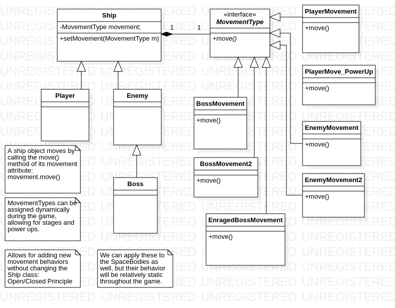

# UML Design

Some of the UML Design Patterns used in the project along with their justification is listed below.

## Strategy Pattern for Ship behavior

### Problem
There are 3 subclasses of the abstract Ship class, the Player class, the Enemy class, and the subclass of the Enemy, the Boss class. A Ship must have a move() function to change position on the screen as the game advances. Defining the move() function in the Ship class would mean that the subclasses would have to override their methodos with the appropriate behavior and the subclasses would have to modify their respective functions if the game logic required changes in movement behavior. In addition, any additional classes derived from the Ship class will inherit the move() function even if the class/object does not need to move. 

* Pros: The strategy pattern allows the movement behavior to be separated from the Ship class by encapsulating it and enables assignment of the behavior dynamically during runtime. For example, the player ship may learn a new movement skill as it advances through the game, or a boss encounter may have multiple stages, each of which has distinct movement patterns. Also, enemy movement patterns can be changed as the game progresses to follow more complicated patterns. The game can be extended with additional behaviors with minimal changes to the client code.

* Cons: Each movement behavior is a concrete implementation of an interface and must be implemented separately. As a result, we will initially focus on some standard behavior, then implement some basic variations, and add additional behaviors as the game development progresses.

